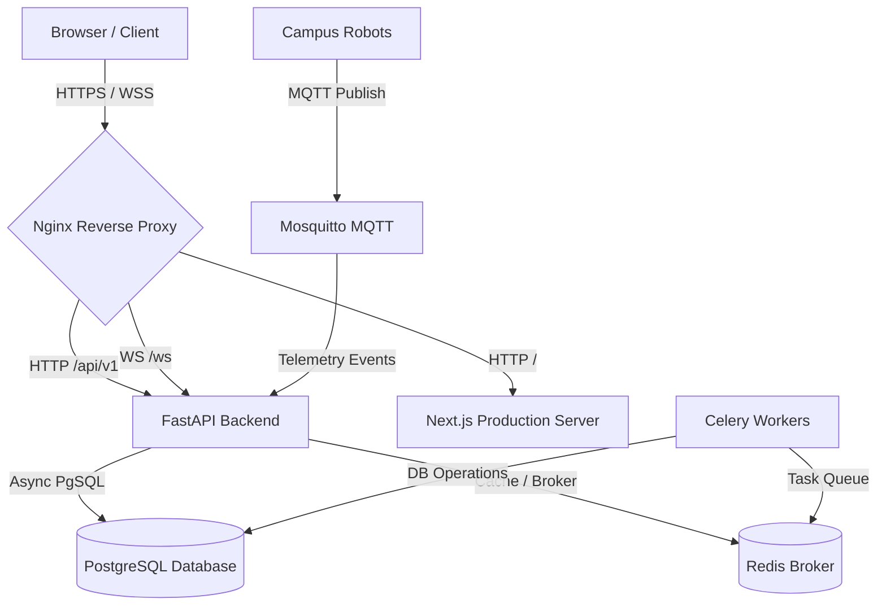

# DSR Delivery Bot — Production Deployment Guide

This document provides complete instructions for deploying the **DSR Delivery Bot (Smart Autonomous Campus Delivery Robot Platform)** to a production environment. 

The deployment model leverages a **multi-container Docker Compose** architecture fronted by an **Nginx** reverse proxy, handling SSL termination, Static asset caching, API routing, and secure WebSocket upgrading.

---

## 🏗️ Production Architecture Overview

In a production environment, the services run in optimized Docker containers:



---

## 🔒 Production Security Checklist

Before deploying, ensure you configure the following settings:

1.  **Generate a Cryptographically Secure `SECRET_KEY`**:
    Never use the default or development secret key in production. Generate a strong key using:
    ```bash
    python -c "import secrets; print(secrets.token_hex(32))"
    ```
2.  **Turn off FastAPI debug docs** in extremely high-security environments, or gate `/docs` and `/redoc` with basic authentication.
3.  **Use Strong Database and Redis passwords** (avoid `dsr_delivery_bot_dev_pass` or blank credentials).
4.  **Set up Let's Encrypt / SSL Certificates** for secure `https://` and `wss://` traffic.
5.  **Secure Mosquitto MQTT Broker**: Enable username/password authentication or token authentication for robots. Do not expose `1883` to the open web without firewall restrictions to campus-only IPs.

---

## 🚀 Deployment Steps

### Step 1: Clone & Configure Environments

1. Clone the repository on the production host:
   ```bash
   git clone <repository_url> /opt/dsr_delivery_bot
   cd /opt/dsr_delivery_bot
   ```

2. Create a production environment file `docker-compose.prod.yml` and a production `.env` file:
   ```bash
   cp .env.example .env
   ```

3. Modify `.env` with production-ready values:
   ```env
   APP_NAME=DSR Delivery Bot
   APP_VERSION=1.0.0
   APP_ENV=production
   SECRET_KEY=9a2f7c00e12d4d98a0fcb5b8ee911762c9384bb882798e4cdb5ab9a3efc21bc4  # Generate a unique key!
   
   POSTGRES_HOST=postgres
   POSTGRES_PORT=5432
   POSTGRES_DB=dsr_delivery_bot
   POSTGRES_USER=dsr_delivery_bot_prod_user
   POSTGRES_PASSWORD=your_super_secure_postgres_password_here
   
   REDIS_HOST=redis
   REDIS_PORT=6379
   
   MQTT_BROKER_HOST=mqtt
   MQTT_BROKER_PORT=1883
   
   ACCESS_TOKEN_EXPIRE_MINUTES=30
   REFRESH_TOKEN_EXPIRE_DAYS=7
   
   CORS_ORIGINS=https://dsr_delivery_bot.silveroakuni.ac.in,https://www.dsr_delivery_bot.silveroakuni.ac.in
   
   NEXT_PUBLIC_API_URL=https://dsr_delivery_bot.silveroakuni.ac.in
   NEXT_PUBLIC_WS_URL=wss://dsr_delivery_bot.silveroakuni.ac.in
   ```

---

### Step 2: Configure SSL with Nginx & Let's Encrypt

Ensure you have Nginx configured to point to your SSL certificates.
Here is an example structure of `docker/nginx/nginx.conf` updated for production SSL:

```nginx
events { worker_connections 1024; }

http {
    include       mime.types;
    default_type  application/octet-stream;
    sendfile        on;
    keepalive_timeout  65;

    # Redirect HTTP to HTTPS
    server {
        listen 80;
        server_name dsr_delivery_bot.silveroakuni.ac.in;
        return 301 https://$host$request_uri;
    }

    # HTTPS Server
    server {
        listen 443 ssl;
        server_name dsr_delivery_bot.silveroakuni.ac.in;

        ssl_certificate /etc/letsencrypt/live/dsr_delivery_bot.silveroakuni.ac.in/fullchain.pem;
        ssl_certificate_key /etc/letsencrypt/live/dsr_delivery_bot.silveroakuni.ac.in/privkey.pem;
        ssl_protocols TLSv1.2 TLSv1.3;
        ssl_ciphers HIGH:!aNULL:!MD5;

        # Frontend Next.js Pages
        location / {
            proxy_pass http://frontend:3000;
            proxy_http_version 1.1;
            proxy_set_header Upgrade $http_upgrade;
            proxy_set_header Connection 'upgrade';
            proxy_set_header Host $host;
            proxy_cache_bypass $http_upgrade;
        }

        # Backend FastAPI API Router
        location /api {
            proxy_pass http://backend:8000;
            proxy_set_header Host $host;
            proxy_set_header X-Real-IP $remote_addr;
            proxy_set_header X-Forwarded-For $proxy_add_x_forwarded_for;
            proxy_set_header X-Forwarded-Proto $scheme;
        }

        # WebSocket Tracking & Notifications
        location /ws {
            proxy_pass http://backend:8000;
            proxy_http_version 1.1;
            proxy_set_header Upgrade $http_upgrade;
            proxy_set_header Connection "Upgrade";
            proxy_set_header Host $host;
            proxy_set_header X-Real-IP $remote_addr;
            proxy_set_header X-Forwarded-For $proxy_add_x_forwarded_for;
            proxy_set_header X-Forwarded-Proto $scheme;
            proxy_read_timeout 86400s;
            proxy_send_timeout 86400s;
        }
    }
}
```

---

### Step 3: Launch with Docker Compose (Production Bundle)

Run the production multi-container setup. The production file `docker-compose.prod.yml` compiles optimized images for backend and frontend (Next.js is pre-built during image assembly):

```bash
docker-compose -f docker-compose.prod.yml up --build -d
```

Verify that all 7 services are running:
*   `postgres` (DB storage)
*   `redis` (Celery queue & caching)
*   `mqtt` (Mosquitto MQTT Broker)
*   `backend` (FastAPI backend server)
*   `celery` (Celery background worker)
*   `frontend` (Next.js server in SSR mode)
*   `nginx` (Reverse proxy with SSL)

Check the container logs to ensure everything booted properly:
```bash
docker-compose -f docker-compose.prod.yml logs -f
```

---

### Step 4: Run Database Migrations

Once PostgreSQL is up, execute Alembic migrations inside the backend container to build your database tables:

```bash
docker-compose -f docker-compose.prod.yml exec backend alembic upgrade head
```

---

## 📈 Monitoring & Maintenance

### 1. Database Backups
Ensure standard PostgreSQL backup routines are executed daily. You can dump the production database using:
```bash
docker-compose -f docker-compose.prod.yml exec postgres pg_dump -U dsr_delivery_bot_prod_user dsr_delivery_bot > backup.sql
```

### 2. MQTT Broker Log Auditing
Inspect Mosquitto broker connections to identify robot connection state changes:
```bash
docker-compose -f docker-compose.prod.yml logs -f mqtt
```

### 3. Scaling Celery Workers
In peak hours, you can scale the Celery container to handle high loads of background notifications and status updates:
```bash
docker-compose -f docker-compose.prod.yml up -d --scale celery=3
```
